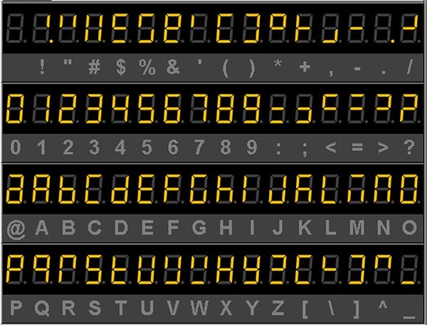

# VHDL Projekt - Vysílač a přijímač Morseova kódu

### Členové týmu
* Filip Tůma (230896) - šéf týmu, nejlepší
* Viktor Vlček (240709) - svačinář
* Roman Vaněk (240707) - osciloskop master

## Teoretický úvod
:blue_square: 1 ČÁRKA     :yellow_square: 0 TEČKA

## 7-segment abeceda

## Popis hardwaru
    

## Popis softwaru
### Simulace

## Instrukce k používání

## Reference

