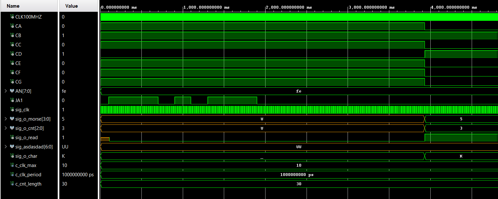

# VHDL Projekt - Vysílač a přijímač Morseova kódu

### Členové týmu
* Filip Tůma (230896) 
* Viktor Vlček (240709) 
* Roman Vaněk (240707) 

## Teoretický úvod
:blue_square: 1 ČÁRKA     :yellow_square: 0 TEČKA


V Morseově kódu jsme našli algoritmus podle kterého jsme postupovali. Z teček jsme udělali logickou 0, z čárek logickou 1. Dále jsme pak počítali počet stisknutí buttonu. Z daného binárního kódu jsme udělali dekadické číslo. Počet zmáčknutí číselně odpovídal abecednímu sloupci. Dekadický kód byl dále určitý znak, který jsme indexovali od 0. Jednotlivá písmena jsme zobrazovali na 7-segmentovém displeji. 

### 7-segment abeceda


## Popis hardwaru

# Clock enable

- **File**: period_cnt.vhd
- **Copyright:** (c) 2023 Roman Vanek
 This work is licensed under the terms of the MIT license
- **Author:** Roman Vanek
## Diagram


## Description

 Counting period of input signal i_logic then assigns it either '0' or '1'
 if it is shorter then g_dot_length respectively longer then g_dot_length.
 Output will be provided when i_space changes to '1' as n-bit value of o_morse.
 n (number of bits to read) is stored in o_cnt
 !! Read output values only when o_read is '1' !!
## Generics

| Generic name | Type    | Value | Description                                               |
| ------------ | ------- | ----- | --------------------------------------------------------- |
| g_dot_length | natural | 5     | Number of clk pulses to generate one enable signal period |
## Ports

| Port name | Direction | Type                         | Description |
| --------- | --------- | ---------------------------- | ----------- |
| clk       | in        | std_logic                    |             |
| i_space   | in        | std_logic                    |             |
| i_logic   | in        | std_logic                    |             |
| o_morse   | out       | std_logic_vector(3 downto 0) |             |
| o_cnt     | out       | std_logic_vector(2 downto 0) |             |
| o_read    | out       | std_logic                    |             |
## Signals

| Name        | Type                  | Description   |
| ----------- | --------------------- | ------------- |
| sig_counter | unsigned(31 downto 0) |               |
| sig_morse   | unsigned(3 downto 0)  |               |
| sig_cnt     | natural               | Local counter |
| sig_read    | std_logic             |               |
## Processes
- p_period_cnt: ( clk )

<div style="background-color: beige; padding: 10px">
# Morse Code Reciever

- **File**: morse_reciever.vhd
- **Copyright:** (c) 2023 Roman Vanek
 This work is licensed under the terms of the MIT license
- **Author:** Roman Vanek
## Diagram


## Description

 On rising edge of i_read, it assign defined segments on 7 segment
 display coresponding to i_morse and i_cnt.
 It assumes 7 segment with active zero logic.
## Ports

| Port name | Direction | Type                         | Description |
| --------- | --------- | ---------------------------- | ----------- |
| i_morse   | in        | std_logic_vector(3 downto 0) |             |
| i_cnt     | in        | std_logic_vector(2 downto 0) |             |
| i_read    | in        | std_logic                    |             |
| o_char    | out       | character                    |             |
| o_7seg    | out       | std_logic_vector(6 downto 0) |             |
## Processes
- p_morse_reciever: ( i_read, i_morse, i_cnt )
</div>

## Popis softwaru
```vhdl
-- vsg_off
----------------------------------------------------------
--
--! @title Clock enable
--! @author Roman Vanek
--!
--! @copyright (c) 2023 Roman Vanek
--! This work is licensed under the terms of the MIT license
--!
--
-- Hardware: Nexys A7-50T, xc7a50ticsg324-1L
-- Software: TerosHDL, Vivado 2020.2, EDA Playground
--
----------------------------------------------------------


library IEEE;
use IEEE.STD_LOGIC_1164.ALL;

-- Uncomment the following library declaration if using
-- arithmetic functions with Signed or Unsigned values
--use IEEE.NUMERIC_STD.ALL;

-- Uncomment the following library declaration if instantiating
-- any Xilinx leaf cells in this code.
--library UNISIM;
--use UNISIM.VComponents.all;

entity top is
    Port 
    ( 
        CLK100MHZ   : in std_logic;
        BTNC        : in std_logic;
        CA          : out std_logic;
        CB          : out std_logic;
        CC          : out std_logic;
        CD          : out std_logic;
        CE          : out std_logic;
        CF          : out std_logic;
        CG          : out std_logic;
        AN          : out std_logic_vector(7 downto 0);
        JA1         : in std_logic;
        JA2         : out std_logic
    );
end top;
architecture Behavioral of top is

  -- Counter constants
  constant c_clk_max    : natural := 1000000;   -- 10 ms
  constant c_cnt_length : natural := 30; -- > 300 ms => DASH 

  signal sig_clk      : std_logic;                    -- Main clock

  signal sig_o_morse : std_logic_vector(3 downto 0); -- Full morse code in respect to o_cnt!
  signal sig_o_cnt   : std_logic_vector(2 downto 0); -- Number of o_morse bits to read 0 - 4
  signal sig_o_read  : std_logic;

  signal sig_o_char  : character;

begin

  uut_period_cnt1 : entity work.period_cnt
    generic map (
      g_dot_length => c_cnt_length
    )
    port map (
      clk     => sig_clk,
      i_space => BTNC,
      i_logic => JA1,
      o_morse => sig_o_morse,
      o_cnt   => sig_o_cnt,
      o_read  => sig_o_read
    );

  uut_morse_reciever : entity work.morse_reciever
    port map (
      i_morse => sig_o_morse,
      i_cnt   => sig_o_cnt,
      i_read  => sig_o_read,
      o_char  => sig_o_char,
      o_7seg(6) => CA,
      o_7seg(5) => CB,
      o_7seg(4) => CC,
      o_7seg(3) => CD,
      o_7seg(2) => CE,
      o_7seg(1) => CF,
      o_7seg(0) => CG
    );

  uut_clock_enable : entity work.clock_enable
    generic map (
      g_max => c_clk_max
    )
    port map (
      clk => CLK100MHZ,
      rst => '0',
      ce  => sig_clk
    );
    
   AN <= b"1111_1110";
   
   JA2 <= sig_clk;


end Behavioral;
```

### Rozlišování periody
```vhdl
architecture behavioral of period_cnt is

  -- Local counter
  signal sig_counter : unsigned(31 downto 0) := (others => '0');
  signal sig_morse   : unsigned(3 downto 0)  := (others => '0'); 
  signal sig_cnt     : natural               := 0;               --! Local counter
  signal sig_read    : std_logic             := '0';

begin

  --------------------------------------------------------
  -- p_period_cnt:
  -- Local counter is active high. When i_logic is released,
  -- DASH or DOT is assigned to sig_morse at coresponding index.
  -- Output variables o_morse, o_cnt are enabled when i_space is
  -- HIGH (representing space between characters), this event
  -- is signalized by o_read
  --------------------------------------------------------
  p_period_cnt : process (clk) is
  begin

    if rising_edge(clk) then                                   -- Synchronous process
      if (i_logic = '1') then
        sig_read    <= '0';
        o_read      <= '0';                                    -- Dont read yet
        sig_counter <= sig_counter + 1;
      elsif (sig_counter > 0) then                             -- end of logic signal
        -- asigh DASH or DOT to correct position
        if (sig_counter > g_dot_length) then
          sig_morse(sig_cnt) <= '1';                           -- DASH
        else
          sig_morse(sig_cnt) <= '0';                           -- DOT
        end if;
        -- next index if sig_morse (whole letter)
        sig_cnt     <= sig_cnt + 1;
        sig_counter <= (others => '0');
      end if;

      if (i_space = '1' and sig_read = '0') then
        -- LETTER is completed (init read stage)
        o_morse  <= std_logic_vector(sig_morse);
        o_cnt    <= std_logic_vector(to_unsigned(sig_cnt, 3));
        o_read   <= '1';
        sig_read <= '1';

        -- Reset all values
        sig_counter <= (others => '0');
        sig_morse   <= (others => '0');
        sig_cnt     <= 0;
      end if;
    end if;

  end process p_period_cnt;

end architecture behavioral;
```
### Pťijímač morzeova kódu
```vhdl
  p_morse_reciever : process (i_read, i_morse, i_cnt) is
  begin

    if rising_edge(i_read) then

      --sig_column <= unsigned(i_cnt);
      --sig_row <= unsigned(i_morse);

      case i_cnt is

        when "001" =>

          case i_morse is
            when "0000" =>
              o_char <= 'E';
              o_7seg <= "0110000"; -- E

            when "0001" =>
              o_char <= 'T';
              o_7seg <= "1110000"; -- T

            when others =>
              o_char <= 'e';    -- ERROR
              o_7seg <= "0010010"; -- 2
  .
  .
  .
```
### Simulace
Na simulaci můžeme vidět JA1 jako tlačítko (morseúv kód), sig_clk je časový signál pro čítač periody daný z hlavního poděleného 100 MHz časového signálu. Samotný výstup se rozliší po stisknutí BTNC, reprezentující "mezeru" mezi písmeny.

